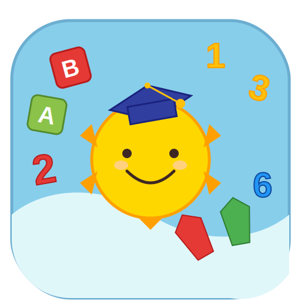

<div align="center">
  
  <h1>Kids World</h1>
  <p>
    <b>An interactive and fun educational web application for kids to learn Hebrew, English, and Math.</b>
  </p>

  <p>
    
    
    
    
    
  </p>
</div>

---

## 📚 About The Project

Kids World is a gamified learning platform designed to make education enjoyable for children. It features interactive games and quizzes covering various subjects including:

- **Hebrew**: Alphabet learning, memory games, and letter identification.
- **English**: Vocabulary building and letter games.
- **Math**: Basic arithmetic operations and fun challenges.

The application works seamlessly on both desktop and mobile devices, providing a responsive and engaging user experience with vibrant animations.

## 🚀 Technologies

This project is built using modern web technologies:

- **[React](https://react.dev/)**: For building the user interface.
- **[TypeScript](https://www.typescriptlang.org/)**: For static type checking and better developer experience.
- **[Vite](https://vitejs.dev/)**: For fast development and building.
- **[Styled Components](https://styled-components.com/)**: For component-level styling and theming.
- **[Node.js](https://nodejs.org/) & [Express](https://expressjs.com/)**: For the backend server.
- **[Framer Motion](https://www.framer.com/motion/)**: For smooth animations.
- **[i18next](https://www.i18next.com/)**: For internationalization (English & Hebrew side-by-side).

## 📂 Repository Structure

```
kids-world/
├── public/              # Static assets (favicons, etc.)
├── src/                 # Source code
│   ├── components/      # Reusable UI components
│   ├── data/            # Static data sets (letters, words)
│   ├── pages/           # Page components (Hebrew, English, Math)
│   ├── styles/          # Global styles and themes
│   ├── App.tsx          # Main application component
│   └── main.tsx         # Entry point
├── server.js            # Node.js server entry point
├── package.json         # Project dependencies and scripts
├── vite.config.ts       # Vite configuration
└── README.md            # Project documentation
```

## 🛠️ Getting Started

### Prerequisites

- Node.js installed on your machine.
- npm (Node Package Manager).

### Installation

1.  Clone the repository:
    ```bash
    git clone https://github.com/tzahita/kids-world.git
    cd kids-world
    ```

2.  Install dependencies:
    ```bash
    npm install
    ```

### Running the Application

**Development Mode:**
To start the Vite development server with Hot Module Replacement (HMR):
```bash
npm run dev
```

**Production Mode:**
To build the application and start the Express server (simulating production):
```bash
npm run build
npm start
```

The application will be available at `http://localhost:3000`.

## 🎨 Features

- **Gamification**: Reward systems and fun graphics to keep kids engaged.
- **Bilingual Support**: Full support for English and Hebrew (LTR/RTL).
- **Responsive Design**: Optimized for tablets and mobile phones.
- **Accessibility**: Clear fonts and high-contrast colors.
